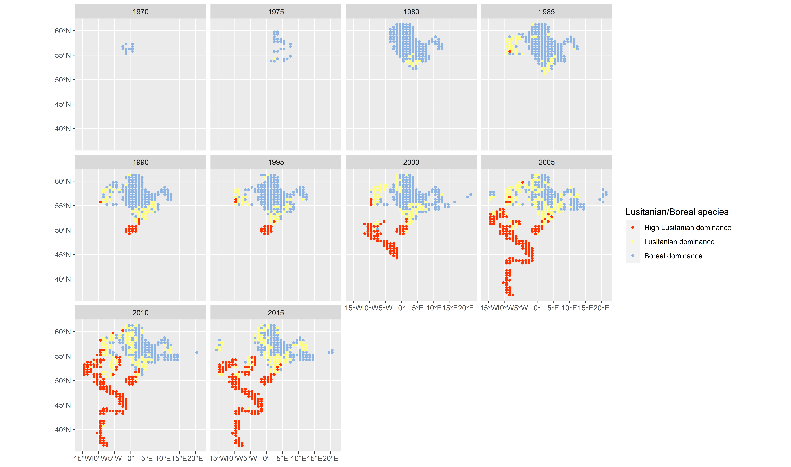
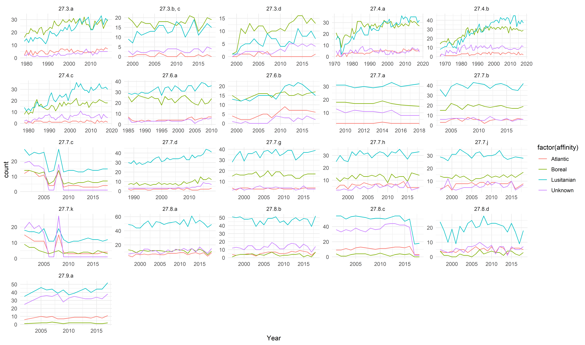

```{r setup, echo = FALSE}
library(icesTAF)
library(knitr)
```

## Figure 1
## Temporal development of the Lusitanian/Boreal species ratio with 
##  5 years interval, 1965-2016

```{r figure_1}

```

## Figure 2
## Temporal development in the number of species of each
##  biogeographical affinity group

```{r figure_2}

```


## Table 1

```{r table1}
table1_survey_overview <- read.taf("report/table1_survey_overview.csv")

kable(table1_survey_overview)
```

