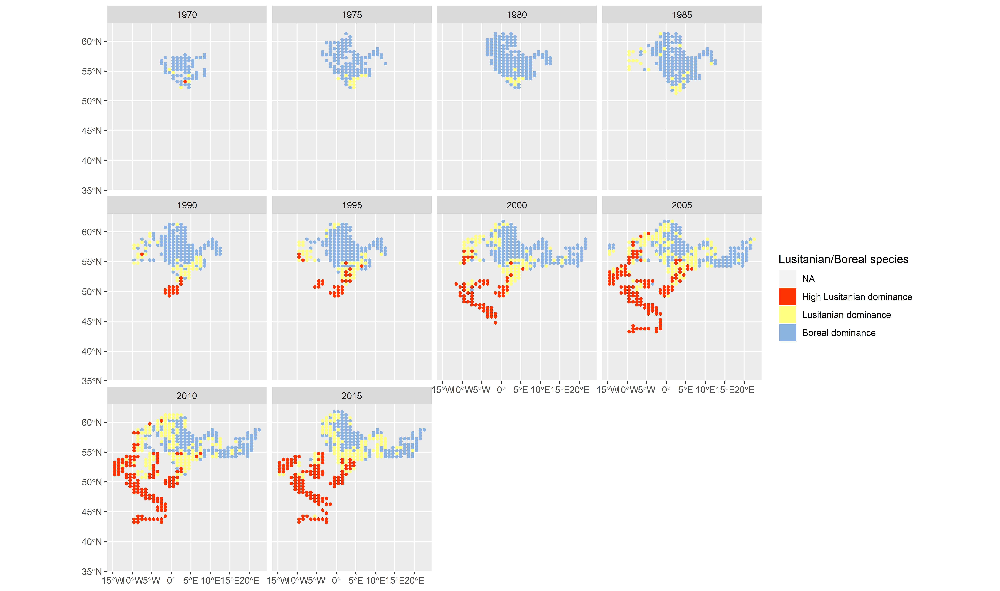

```{r setup, echo = FALSE}
library(icesTAF)
library(knitr)
```

## Figure 1
```{r figure 1}

```


## Table 1

```{r table1}
table1_survey_overview <- read.taf("report/table1_survey_overview.csv")

kable(table1_survey_overview)
```
